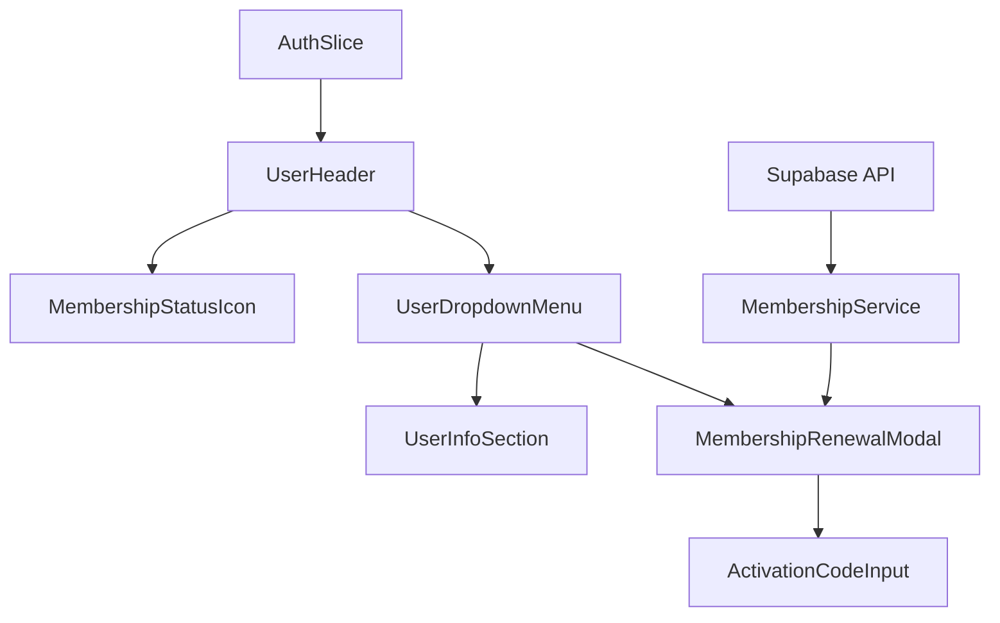
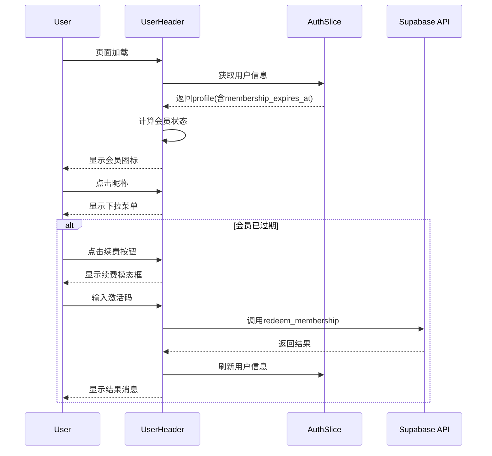

# 设计文档

## 概述

会员状态显示系统是一个用户界面增强功能，旨在为用户提供清晰的会员状态可视化和便捷的续费操作。该系统将在现有的用户头部组件基础上扩展，添加会员状态图标、详细信息下拉菜单和激活码续费功能。

## 架构

### 组件架构



### 数据流



## 组件和接口

### 1. 类型定义扩展

```typescript
// 扩展现有的UserProfile接口
export interface UserProfile {
  id: string;
  role: 'admin' | 'teacher' | 'parent' | 'student';
  display_name: string;
  avatar_url?: string;
  settings?: any;
  has_password_set?: boolean;
  membership_expires_at?: string | null; // 新增：会员到期时间戳
}

// 会员状态类型
export type MembershipStatus = 'active' | 'expired' | 'unknown';

// 会员状态信息
export interface MembershipInfo {
  status: MembershipStatus;
  expiresAt?: Date;
  isExpired: boolean;
  daysRemaining?: number;
}

// 续费接口参数
export interface RenewalRequest {
  activationCode: string;
}

// 续费接口响应
export interface RenewalResponse {
  success: boolean;
  message: string;
  newExpiryDate?: string;
}
```

### 2. 会员状态服务

```typescript
export class MembershipService {
  // 计算会员状态
  static getMembershipInfo(membershipExpiresAt?: string | null): MembershipInfo;
  
  // 格式化到期时间显示（仅显示日期，不包含时分秒）
  static formatExpiryDate(expiresAt: Date): string;
  
  // 验证激活码格式
  static validateActivationCode(code: string): boolean;
  
  // 续费操作
  static async renewMembership(code: string): Promise<RenewalResponse>;
}
```

### 3. UI组件接口

```typescript
// 会员状态图标组件
export interface MembershipStatusIconProps {
  status: MembershipStatus;
  className?: string;
}

// 用户下拉菜单组件
export interface UserDropdownMenuProps {
  user: UserProfile;
  membershipInfo: MembershipInfo;
  onRenewal?: () => void;
  onClose?: () => void;
}

// 续费模态框组件
export interface MembershipRenewalModalProps {
  isOpen: boolean;
  onClose: () => void;
  onSuccess: (newExpiryDate: string) => void;
}
```

## 数据模型

### 会员状态计算逻辑

```typescript
function calculateMembershipStatus(membershipExpiresAt?: string | null): MembershipInfo {
  // null或undefined视为过期
  if (!membershipExpiresAt) {
    return {
      status: 'expired',
      isExpired: true
    };
  }
  
  const expiryDate = new Date(membershipExpiresAt);
  const now = new Date();
  
  // 无效日期视为未知状态
  if (isNaN(expiryDate.getTime())) {
    return {
      status: 'unknown',
      isExpired: true
    };
  }
  
  const isExpired = expiryDate <= now;
  const daysRemaining = isExpired ? 0 : Math.ceil((expiryDate.getTime() - now.getTime()) / (1000 * 60 * 60 * 24));
  
  return {
    status: isExpired ? 'expired' : 'active',
    expiresAt: expiryDate,
    isExpired,
    daysRemaining
  };
}
```

## 正确性属性

*属性是一个特征或行为，应该在系统的所有有效执行中保持为真——本质上，是关于系统应该做什么的正式声明。属性作为人类可读规范和机器可验证正确性保证之间的桥梁。*

**Property 1: 会员状态图标显示正确性**
*对于任何* 用户资料和当前时间，当会员到期时间大于当前时间时，系统应显示VIP图标；当到期时间小于等于当前时间或为null时，应显示灰色图标
**验证: Requirements 1.1, 1.2**

**Property 2: 会员状态计算一致性**
*对于任何* 会员到期时间戳和当前时间戳，会员状态计算结果应与时间戳比较逻辑一致
**验证: Requirements 1.3**

**Property 3: 用户界面信息完整性**
*对于任何* 已登录用户，用户界面应显示昵称、身份和会员状态图标这三个基本信息
**验证: Requirements 1.5**

**Property 4: 下拉菜单内容正确性**
*对于任何* 用户资料，下拉菜单应包含用户昵称、身份和会员到期时间信息
**验证: Requirements 2.2**

**Property 5: 续费按钮条件显示**
*对于任何* 会员状态，当且仅当会员已过期时，下拉菜单中应显示续费按钮
**验证: Requirements 2.3, 2.4**

**Property 6: 激活码格式验证**
*对于任何* 输入的激活码字符串，系统应根据预定义格式规则正确验证其有效性
**验证: Requirements 3.2, 4.3**

**Property 7: 续费成功状态更新**
*对于任何* 成功的续费操作，系统应更新用户信息并反映新的会员到期时间
**验证: Requirements 3.4, 3.6**

**Property 8: 错误处理一致性**
*对于任何* 续费失败或网络错误，系统应显示适当的错误消息给用户
**验证: Requirements 3.5, 4.2**

**Property 9: 界面响应性更新**
*对于任何* 用户信息变更，界面显示应立即反映最新的数据状态
**验证: Requirements 4.4**

## 错误处理

### 1. 网络错误处理
- 续费接口调用失败时显示网络错误提示
- 用户信息刷新失败时保持当前状态并提示用户

### 2. 数据验证错误
- 激活码格式无效时在客户端拦截并提示
- membership_expires_at字段为null或无效时优雅降级为过期状态

### 3. 用户体验错误
- 续费过程中禁用相关按钮防止重复提交
- 提供清晰的加载状态和进度反馈

## 测试策略

### 单元测试
- 会员状态计算逻辑测试
- 激活码格式验证测试
- 日期格式化和显示测试（仅显示日期部分）
- 组件渲染和交互测试

### 属性测试
- 使用fast-check库进行属性测试
- 每个属性测试运行最少100次迭代
- 生成随机的时间戳、用户数据和激活码进行测试
- 测试边界条件和异常情况

### 集成测试
- 用户头部组件与认证状态的集成
- 续费流程的端到端测试
- Supabase API调用的集成测试

### 测试库配置
- 使用fast-check作为属性测试库
- 配置每个属性测试运行100次迭代
- 使用React Testing Library进行组件测试
- 使用MSW模拟API响应进行集成测试