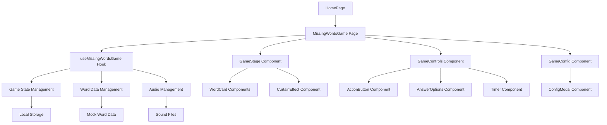

# Design Document: Missing Words Game

## Overview

"哪个词语不见了？"游戏是一个独立的观察记忆游戏，专为儿童设计。游戏采用React + TypeScript技术栈，使用Tailwind CSS进行样式设计，通过Custom Hook管理游戏状态，确保与现有通用游戏系统完全隔离。

游戏核心机制是让玩家观察散落在舞台上的词语卡片，然后通过幕布效果隐藏部分词语，要求玩家识别消失的词语。支持休闲和挑战两种模式，提供丰富的动画效果和音效反馈。

## Architecture

### 系统架构图



### 路由设计

游戏将添加新的路由 `/missing-words-game`，完全独立于现有的通用游戏路由系统。

## Components and Interfaces

### 1. MissingWordsGame (主游戏页面)

**职责：**
- 作为游戏的主容器组件
- 协调各个子组件的交互
- 管理整体布局和响应式设计

**Props接口：**
```typescript
interface MissingWordsGameProps {
  // 无需外部props，完全独立运行
}
```

### 2. useMissingWordsGame (核心游戏Hook)

**职责：**
- 管理游戏状态和生命周期
- 处理游戏逻辑和状态转换
- 管理音效播放
- 处理配置变更
- 管理词语数据（当前使用mock，预留接口扩展）

**返回接口：**
```typescript
interface MissingWordsGameState {
  // 游戏状态
  gamePhase: 'idle' | 'observation' | 'curtain' | 'answer' | 'result'
  gameMode: 'casual' | 'challenge'
  
  // 游戏配置
  config: GameConfig
  
  // 词语数据
  currentWords: Word[]
  hiddenWords: Word[]
  allWords: Word[]
  answerOptions: Word[]
  
  // 计时器
  observationTimeLeft: number
  
  // 用户交互
  selectedAnswers: string[]
  showResult: boolean
  
  // 方法
  startGame: () => void
  handleObservationComplete: () => void
  handleAnswerSelect: (wordId: string) => void
  handleSubmitAnswer: () => void
  handleShowAnswer: () => void
  updateConfig: (newConfig: Partial<GameConfig>) => void
  resetGame: () => void
  
  // 为未来扩展预留的数据获取方法
  loadWordsFromSource?: (params: WordRequestParams) => Promise<void>
}
```

### 3. GameStage (游戏舞台组件)

**职责：**
- 渲染词语卡片的舞台区域
- 管理词语卡片的布局和动画
- 实现幕布效果

**Props接口：**
```typescript
interface GameStageProps {
  words: Word[]
  gamePhase: GamePhase
  onCurtainComplete: () => void
}
```

### 4. WordCard (词语卡片组件)

**职责：**
- 显示单个词语
- 处理中英文字体切换
- 提供卡片动画效果

**Props接口：**
```typescript
interface WordCardProps {
  word: Word
  isVisible: boolean
  position: { x: number; y: number }
  animationDelay: number
}
```

### 5. GameControls (游戏控制组件)

**职责：**
- 渲染游戏控制按钮
- 显示答题选项
- 管理计时器显示

**Props接口：**
```typescript
interface GameControlsProps {
  gamePhase: GamePhase
  gameMode: GameMode
  timeLeft: number
  answerOptions: Word[]
  selectedAnswers: string[]
  onObservationComplete: () => void
  onAnswerSelect: (wordId: string) => void
  onSubmitAnswer: () => void
  onShowAnswer: () => void
}
```

### 6. CurtainEffect (幕布效果组件)

**职责：**
- 实现幕布合拢和拉开动画
- 完全遮挡舞台防止用户看到词语消失过程
- 在幕布完全遮挡期间触发词语移除逻辑

**Props接口：**
```typescript
interface CurtainEffectProps {
  isActive: boolean
  onComplete: () => void
  // 确保幕布完全遮挡舞台
  fullCoverage: boolean
}
```

### 7. GameConfigModal (游戏配置弹窗)

**职责：**
- 提供游戏参数配置界面
- 处理配置保存和游戏重启确认

**Props接口：**
```typescript
interface GameConfigModalProps {
  isOpen: boolean
  currentConfig: GameConfig
  onClose: () => void
  onSave: (config: GameConfig) => void
}
```

## Data Models

### 游戏配置模型

```typescript
interface GameConfig {
  gameMode: 'casual' | 'challenge'
  wordCount: number // n: 3-8, default 4
  hiddenCount: number // k: 1-3, default 1
  observationTime: number // t: 3-10 seconds, default 5 (challenge mode only)
}
```

### 词语数据模型

```typescript
interface Word {
  id: string
  text: string
  language: 'chinese' | 'english'
  category?: string
}

// 为未来扩展预留的数据获取接口
interface WordDataSource {
  getWords(params: WordRequestParams): Promise<Word[]>
}

interface WordRequestParams {
  count: number
  language?: 'chinese' | 'english' | 'mixed'
  difficulty?: 'easy' | 'medium' | 'hard'
  category?: string
}
```

### 游戏状态模型

```typescript
type GamePhase = 'idle' | 'observation' | 'curtain' | 'answer' | 'result'
type GameMode = 'casual' | 'challenge'

interface GameState {
  phase: GamePhase
  mode: GameMode
  config: GameConfig
  currentRound: {
    words: Word[]
    hiddenWords: Word[]
    userAnswers: string[]
    isCorrect?: boolean
  }
}
```

### 音效管理模型

```typescript
interface AudioManager {
  playCardAppear: () => void
  playClick: () => void
  playSuccess: () => void
  playError: () => void
  playCurtain: () => void
}
```

## Mock数据设计

```typescript
const mockWords: Word[] = [
  // 中文词语
  { id: '1', text: '苹果', language: 'chinese' },
  { id: '2', text: '香蕉', language: 'chinese' },
  { id: '3', text: '橙子', language: 'chinese' },
  { id: '4', text: '葡萄', language: 'chinese' },
  { id: '5', text: '西瓜', language: 'chinese' },
  { id: '6', text: '草莓', language: 'chinese' },
  { id: '7', text: '樱桃', language: 'chinese' },
  { id: '8', text: '桃子', language: 'chinese' },
  
  // 英文单词
  { id: '9', text: 'apple', language: 'english' },
  { id: '10', text: 'banana', language: 'english' },
  { id: '11', text: 'orange', language: 'english' },
  { id: '12', text: 'grape', language: 'english' },
  { id: '13', text: 'watermelon', language: 'english' },
  { id: '14', text: 'strawberry', language: 'english' },
  { id: '15', text: 'cherry', language: 'english' },
  { id: '16', text: 'peach', language: 'english' },
]
```

## Correctness Properties

*A property is a characteristic or behavior that should hold true across all valid executions of a system-essentially, a formal statement about what the system should do. Properties serve as the bridge between human-readable specifications and machine-verifiable correctness guarantees.*

### Property 1: Game Navigation and Routing
*For any* user interaction with the observe-type game card, clicking "开始游戏" should navigate to the independent missing words game page without requiring textbook selection
**Validates: Requirements 1.2, 1.3**

### Property 2: Configuration Boundary Validation
*For any* game configuration input, the system should enforce valid ranges (n: 3-8, k: 1-3, t: 3-10) and apply correct default values (n=4, k=1, t=5)
**Validates: Requirements 2.3, 2.4, 2.5**

### Property 3: Configuration Change Handling
*For any* configuration modification during active gameplay, the system should display confirmation dialog and restart the game with new parameters upon user confirmation
**Validates: Requirements 2.7, 2.8**

### Property 4: Word Card Display and Animation
*For any* game start, word cards should appear with random positions on stage and trigger appropriate appearance animations with sound effects
**Validates: Requirements 3.2, 3.4**

### Property 5: Multi-language Font Application
*For any* word displayed on a card, Chinese words (≤4 characters) should use KaiTi font and English words should use Fredoka font
**Validates: Requirements 3.8, 3.9**

### Property 6: Mode-Specific UI Display
*For any* game mode selection, casual mode should show "观察好了" button during observation phase, while challenge mode should show countdown timer
**Validates: Requirements 4.1, 4.2**

### Property 7: Game Phase Transitions
*For any* observation phase completion (button click in casual mode or timer expiration in challenge mode), the game should transition to curtain phase and then to answer phase
**Validates: Requirements 4.3, 4.4**

### Property 8: Curtain Effect and Word Hiding
*For any* curtain animation sequence, the curtain should completely cover the stage to hide all words from view, then exactly k words should be randomly selected for removal, and when curtain opens only the remaining words should be visible
**Validates: Requirements 5.1, 5.2, 5.3**

### Property 9: Answer Mode Selection
*For any* challenge mode game with k hidden words, single selection UI should be used when k=1, and multiple selection UI should be used when k>1
**Validates: Requirements 6.4, 6.5**

### Property 10: Answer Feedback Display
*For any* answer submission, correct answers should be highlighted in green and incorrect answers in red
**Validates: Requirements 6.6**

### Property 11: Audio Feedback System
*For any* game interaction (card appearance, user clicks, correct/incorrect answers), appropriate sound effects should be played from the /public/sounds directory
**Validates: Requirements 7.1, 7.2, 7.3, 7.4, 7.5**

### Property 12: Challenge Mode Word Calculation
*For any* challenge mode configuration with n observation words and k hidden words, the system should prepare n+(4-k) total words, using (4-k) as distractors to ensure exactly 4 answer options
**Validates: Requirements 10.1, 10.2, 10.3**

### Property 13: Answer Option Randomization
*For any* challenge mode answer generation, correct answers and distractors should be randomly shuffled in the 4-option display
**Validates: Requirements 10.4**

### Property 14: Game State Isolation
*For any* missing words game operation, the game state and logic should remain completely isolated from universal game systems and not affect other game functionality
**Validates: Requirements 9.2, 9.4**

## Error Handling

### 配置错误处理
- **无效配置值**: 当用户输入超出范围的配置值时，系统应显示错误提示并恢复到有效的默认值
- **配置保存失败**: 当本地存储失败时，系统应显示错误消息并继续使用当前配置
- **配置加载失败**: 当加载保存的配置失败时，系统应使用默认配置并记录错误

### 游戏数据错误处理
- **词语数据不足**: 当mock数据不足以支持当前配置时，系统应显示错误提示并建议调整配置
- **词语加载失败**: 当词语数据加载失败时，系统应显示友好的错误消息并提供重试选项
- **随机选择失败**: 当随机选择词语或位置失败时，系统应使用备用算法确保游戏继续

### 音效错误处理
- **音效文件缺失**: 当音效文件不存在时，系统应静默失败，不影响游戏进行
- **音效播放失败**: 当音效播放失败时，系统应记录错误但继续游戏流程
- **音频权限错误**: 当浏览器阻止音频播放时，系统应显示提示并提供手动启用选项

### UI交互错误处理
- **动画失败**: 当CSS动画不支持或失败时，系统应提供降级的静态显示
- **触摸/点击事件失败**: 当事件监听器失败时，系统应提供备用的交互方式
- **响应式布局问题**: 当屏幕尺寸不支持时，系统应显示适当的提示信息

## Testing Strategy

### 双重测试方法

本项目采用单元测试和基于属性的测试相结合的方法：

**单元测试**专注于：
- 特定的用户交互场景和边界情况
- 组件集成点的验证
- 错误条件和异常处理
- 具体的UI状态和显示逻辑

**基于属性的测试**专注于：
- 跨所有输入的通用属性验证
- 通过随机化实现全面的输入覆盖
- 游戏逻辑的正确性保证
- 配置参数的边界值测试

### 基于属性的测试配置

**测试库选择**: 使用 `fast-check` 库进行基于属性的测试，这是TypeScript/JavaScript生态系统中成熟的属性测试库。

**测试配置要求**:
- 每个属性测试最少运行100次迭代（由于随机化特性）
- 每个属性测试必须引用其对应的设计文档属性
- 标签格式: **Feature: missing-words-game, Property {number}: {property_text}**

**测试覆盖范围**:
- 游戏配置的所有有效组合
- 词语数据的随机生成和选择
- 用户交互的各种序列
- 错误条件和边界情况

### 单元测试重点

**组件测试**:
- WordCard组件的多语言显示
- GameStage组件的布局和动画
- GameControls组件的模式切换
- CurtainEffect组件的动画序列

**Hook测试**:
- useMissingWordsGame的状态管理
- 游戏阶段转换逻辑
- 配置更新和持久化
- 音效管理功能

**集成测试**:
- 完整游戏流程的端到端测试
- 不同模式下的游戏体验
- 配置变更对游戏的影响
- 错误恢复机制

### 测试数据生成

**属性测试生成器**:
```typescript
// 游戏配置生成器
const gameConfigArbitrary = fc.record({
  gameMode: fc.constantFrom('casual', 'challenge'),
  wordCount: fc.integer({ min: 3, max: 8 }),
  hiddenCount: fc.integer({ min: 1, max: 3 }),
  observationTime: fc.integer({ min: 3, max: 10 })
})

// 词语数据生成器
const wordArbitrary = fc.record({
  id: fc.string(),
  text: fc.oneof(
    fc.string({ minLength: 1, maxLength: 4 }), // 中文词语
    fc.string({ minLength: 3, maxLength: 12 }) // 英文单词
  ),
  language: fc.constantFrom('chinese', 'english')
})
```

这种测试策略确保了游戏的可靠性和正确性，同时保持了开发效率和代码质量。