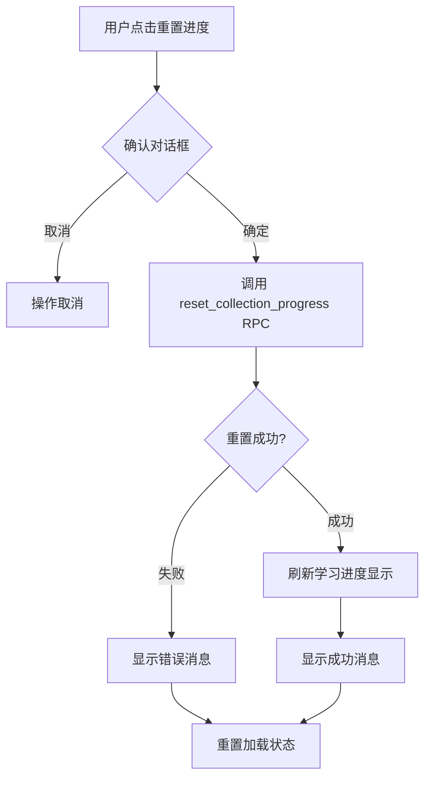

# 🔄 重置学习进度功能

## 📋 功能描述

在设置页面增加了重置学习进度按钮，允许用户一键重置指定教材的学习进度。

## 🎯 使用场景

- 用户想要重新开始学习某个教材
- 用户需要清除之前的学习记录
- 用户想要重新练习所有单词

## 📍 功能位置

**路径：** 设置页面 (`/guess-word/settings`) → 当前教材信息区域

**按钮位置：** 在教材名称下方，学习进度显示的右侧

## 🔧 技术实现

### 后端 RPC 函数
```typescript
await supabase.rpc('reset_collection_progress', {
  p_collection_id: collectionId
});
```

### 前端实现
- **文件：** `src/components/GuessWordSettingsPage.tsx`
- **新增函数：** `handleResetProgress()`
- **新增状态：** `isResetting` (用于显示加载状态)

## 🎮 操作流程

### 用户操作步骤
1. 进入"猜单词"游戏的设置页面
2. 在"当前教材"卡片中找到学习进度信息
3. 点击"重置进度"按钮
4. 在弹出的确认对话框中点击"确定"
5. 系统显示"重置中..."状态
6. 重置成功后显示"学习进度已重置！"提示

### 系统内部流程


## 🎨 UI 交互

### 按钮状态
- **默认状态：** 显示"重置进度"
- **禁用状态：** 当未加载进度时禁用按钮
- **加载状态：** 显示"重置中..."，按钮不可点击

### 视觉反馈
- ✅ 重置成功：弹出成功提示
- ❌ 重置失败：弹出错误消息，包含具体错误信息

## 📊 数据变化

### 重置前
```json
{
  "total_words": 150,
  "mastered_words": 30,
  "remaining_words": 120
}
```

### 重置后
```json
{
  "total_words": 150,
  "mastered_words": 0,
  "remaining_words": 150
}
```

## ⚠️ 注意事项

### 安全提示
- **操作不可撤销**：重置操作无法恢复
- **二次确认**：系统会弹出确认对话框防止误操作

### 用户提示
- 用户点击重置按钮后会弹出确认框
- 确认框文案："确定要重置学习进度吗？此操作不可撤销。"
- 操作完成后会显示"学习进度已重置！"提示

### 错误处理
1. **网络错误**：显示"重置进度时发生错误，请稍后重试"
2. **RPC 错误**：显示"重置失败: {具体错误信息}"
3. **权限错误**：确保用户已登录且有权限操作

## 🧪 测试建议

### 测试场景
1. **正常流程测试**
   - [ ] 进入设置页面
   - [ ] 点击重置进度按钮
   - [ ] 确认重置操作
   - [ ] 验证进度归零

2. **取消操作测试**
   - [ ] 点击重置进度按钮
   - [ ] 点击取消
   - [ ] 验证进度未变

3. **错误处理测试**
   - [ ] 断网状态下重置
   - [ ] 验证错误提示显示

4. **状态管理测试**
   - [ ] 重置过程中按钮应显示"重置中..."
   - [ ] 重置完成后按钮恢复"重置进度"
   - [ ] 按钮在加载时应禁用

## 🔍 相关日志

### 控制台输出
```
[Settings] 开始重置学习进度: {collectionId}
[Settings] 学习进度重置成功
```

### 错误日志
```
重置学习进度失败: {errorMessage}
重置学习进度时发生错误: {error}
```

## 📝 更新记录

- **2025-11-12**：添加重置学习进度功能
  - 位置：GuessWordSettingsPage.tsx
  - 新增：`handleResetProgress()` 函数
  - 新增：`isResetting` 状态
  - 依赖：Supabase RPC `reset_collection_progress`

## 💡 后续优化建议

1. **批量重置**：支持选择多个教材同时重置
2. **重置历史**：记录重置操作历史
3. **撤销功能**：增加短时间内的撤销重置功能
4. **进度预览**：显示重置后的进度对比
5. **密码确认**：对于高级操作要求输入密码确认

---

**开发者：** Claude Code
**创建时间：** 2025-11-12
**状态：** ✅ 已完成
