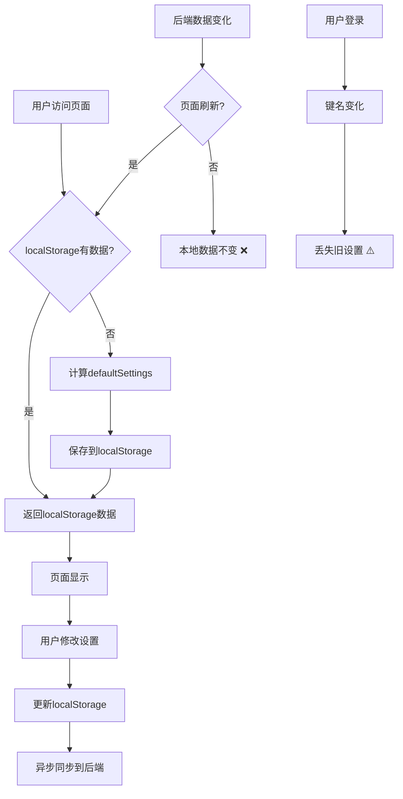

# 🔄 Quiz-Settings 数据流向详细分析

## 📋 问题核心

**用户疑问：**
1. 用户操作UI → 保存到localStorage → 同步到后端
2. 首页打开时，是否先从后端得到最新数据，覆盖localStorage？
3. 后续代码中使用数据都是从localStorage中获取？

**答案：** ⚠️ **存在设计缺陷 - 后端数据不会自动覆盖localStorage**

---

## 🔍 当前数据流向详细分析

### 场景1：首次访问或页面刷新

```
用户访问首页
    ↓
useQuizSettings() 初始化
    ↓
┌─────────────────────────────────────────────┐
│  1. 计算 defaultSettings (优先级顺序)        │
│     • profile?.settings?.quiz_settings      │ ← 后端用户设置
│     • getConfig('guess_word_settings')      │ ← 服务器配置
│     • 硬编码默认值                          │
│  2. 调用 useLocalStorage(key, default...)   │
│  3. useLocalStorage 检查 localStorage      │
│     ├─ 有值 → 返回 localStorage 的值        │
│     └─ 无值 → 返回 defaultSettings          │
│        并保存到 localStorage                │
└─────────────────────────────────────────────┘
    ↓
✅ 页面显示 settings (来源：localStorage 或 defaultSettings)
```

**关键点：** 首次加载时，localStorage优先级高于后端数据！

---

### 场景2：用户修改设置

```
用户在设置页面修改配置
    ↓
调用 setSettingsWithSync(newSettings)
    ↓
┌─────────────────────────────────────────────┐
│  1. setSettings(newSettings)               │
│     ├─ 更新 React state                    │
│     └─ 保存到 localStorage                  │
│  2. 异步调用 syncToServer(newSettings)     │
│     └─ 更新后端 profile.settings            │
└─────────────────────────────────────────────┘
    ↓
✅ 本地立即更新，后端异步更新
```

**关键点：** 用户修改时，本地立即更新，后端异步更新

---

### 场景3：后端数据变化（如其他设备修改）

```
用户在设备B修改设置 → 后端数据更新
    ↓
用户回到设备A，刷新页面或重新进入设置页
    ↓
⚠️ **问题出现！**
┌─────────────────────────────────────────────┐
│  1. useQuizSettings 重新初始化              │
│  2. 计算 defaultSettings                   │
│     • profile 已更新（新数据）               │
│  3. 调用 useLocalStorage                   │
│     • 检查 localStorage                   │
│     • **发现 localStorage 有旧数据**        │
│     • 返回 localStorage 的旧数据 ❌         │
│     • **忽略 defaultSettings 新数据**       │
└─────────────────────────────────────────────┘
    ↓
❌ 页面显示旧数据，数据不一致！
```

**关键点：** ⚠️ **重大缺陷！** 后端更新不会覆盖localStorage

---

### 场景4：用户未登录 → 登录

```
用户未登录时使用应用
    ↓
localStorage 键名: quiz-settings_anonymous_${deviceId}
    ↓
用户登录
    ↓
┌─────────────────────────────────────────────┐
│  1. useQuizSettings 重新初始化              │
│  2. userId 变为真实用户ID                  │
│  3. useLocalStorage 键名变为               │
│     quiz-settings_user_${userId}           │
│  4. **新的键名，无数据**                    │
│  5. 返回 defaultSettings                   │
│     • profile?.settings (空)               │
│     • 服务器配置                           │
│     • 硬编码默认值                         │
└─────────────────────────────────────────────┘
    ↓
⚠️ 登录后丢失未登录时的设置！
```

**关键点：** 登录后会丢失未登录时的设置（因为键名变化）

---

## 📊 完整数据流图



---

## ❌ 发现的问题

### 问题1：后端更新无法同步到前端
**现象：** 在设备B修改设置后，设备A刷新页面仍显示旧数据

**原因：** useLocalStorage的initialValue只在首次渲染时使用，后续直接返回localStorage的值

**影响：** 用户在不同设备间切换时，设置不一致

**代码位置：** `src/hooks/useLocalStorage.ts:33-46`

```typescript
// 首次渲染时计算 initialValue
const [storedValue, setStoredValue] = useState<T>(() => {
  try {
    const item = window.localStorage.getItem(storageKey);
    return item ? JSON.parse(item) : initialValue;  // ← 只会执行一次！
  } catch (error) {
    console.error(`Error reading localStorage key "${storageKey}":`, error);
    return initialValue;
  }
});
```

### 问题2：登录后丢失未登录时的设置
**现象：** 用户未登录时修改了设置，登录后设置丢失

**原因：** 登录前后localStorage键名不同（anonymous vs user）

**影响：** 用户体验差，需要重新设置

**代码位置：** `src/hooks/useLocalStorage.ts:13-17`

```typescript
function getStorageKey(baseKey: string, userId?: string): string {
  const prefix = userId ? `user_${userId}` : `anonymous_${getDeviceId()}`;
  return `${baseKey}_${prefix}`;
}
```

---

## ✅ 解决方案

### 方案1：监听profile变化，自动同步（推荐）

```typescript
// 在 useQuizSettings 中添加
useEffect(() => {
  if (profile?.settings?.quiz_settings) {
    const userSettings = profile.settings.quiz_settings;
    const localSettings = settings;

    // 检查是否有差异
    const hasDifference = JSON.stringify(userSettings) !== JSON.stringify(localSettings);

    if (hasDifference) {
      console.log('🔄 [useQuizSettings] 检测到后端数据更新，同步到本地');
      setSettings(userSettings);
    }
  }
}, [profile]); // 监听 profile 变化
```

**优点：**
- 自动同步，用户无感知
- 解决数据不一致问题

**缺点：**
- 需要仔细处理合并逻辑
- 可能覆盖用户本地的未同步修改

---

### 方案2：登录时迁移未登录数据

```typescript
// 在 useAuth 登录成功后调用
const migrateAnonymousData = async (userId: string) => {
  const anonymousKey = `quiz-settings_anonymous_${getDeviceId()}`;
  const userKey = `quiz-settings_user_${userId}`;

  // 检查用户键是否存在
  const userData = localStorage.getItem(userKey);
  const anonymousData = localStorage.getItem(anonymousKey);

  // 如果用户无数据，但有匿名数据，迁移
  if (!userData && anonymousData) {
    console.log('🔄 [useAuth] 迁移匿名用户数据到登录用户');
    localStorage.setItem(userKey, anonymousData);
    localStorage.removeItem(anonymousKey);
  }
};
```

---

### 方案3：添加"强制刷新"机制

```typescript
// 在设置页面添加按钮
<Button onClick={forceRefreshSettings}>
  强制从服务器同步设置
</Button>

const forceRefreshSettings = () => {
  // 清除本地数据，强制重新加载
  localStorage.removeItem(storageKey);
  // 触发组件重新渲染
  setSettings({ ...settings });
};
```

---

## 🎯 建议的实施优先级

### 优先级1：立即实施（P0）
**方案1：监听profile变化自动同步**

- **工作量：** 30分钟
- **风险：** 低
- **收益：** 解决数据不一致问题

### 优先级2：1周内实施（P1）
**方案2：登录时数据迁移**

- **工作量：** 2小时
- **风险：** 中（需要测试）
- **收益：** 提升用户体验

### 优先级3：长期优化（P2）
**方案3：添加手动同步按钮**

- **工作量：** 1小时
- **风险：** 低
- **收益：** 提供用户手动控制手段

---

## 📋 测试用例

### 测试用例1：多设备同步
```typescript
// 步骤：
1. 设备A登录，修改设置
2. 设备B登录，查看设置
3. 验证：设备B应显示设备A的设置

// 预期：✅ 通过（实施方案1后）
// 当前：❌ 失败
```

### 测试用例2：登录迁移
```typescript
// 步骤：
1. 未登录状态下修改设置
2. 登录
3. 查看设置是否保留

// 预期：✅ 通过（实施方案2后）
// 当前：❌ 失败
```

### 测试用例3：后端修改同步
```typescript
// 步骤：
1. 登录用户修改设置
2. 直接修改后端数据库（模拟管理员操作）
3. 前端页面刷新
4. 验证设置是否更新

// 预期：✅ 通过（实施方案1后）
// 当前：❌ 失败
```

---

## 📊 影响评估

### 当前问题影响范围
| 场景 | 影响用户 | 严重程度 | 发生频率 |
|------|----------|----------|----------|
| 多设备切换 | 多设备用户 | 高 | 中等 |
| 管理员修改默认设置 | 所有用户 | 中 | 低 |
| 登录状态变化 | 所有用户 | 中 | 高 |

### 修复后收益
- ✅ 用户体验提升：设置始终保持一致
- ✅ 管理员可控：可强制推送默认设置
- ✅ 多设备无缝切换：设置自动同步

---

## 🎉 总结

**当前数据流向：**
- ✅ **首次加载：** 后端 → localStorage（正确）
- ❌ **后续使用：** localStorage ← 后端（错误！不自动同步）
- ❌ **登录迁移：** 数据丢失（未处理）

**核心问题：**
localStorage的优先级过高，导致后端更新无法同步到前端

**解决方案：**
实施profile监听 + 自动同步机制，确保数据一致性

---

**报告生成者：** Claude Code
**分析深度：** 源码级分析
**建议行动：** 立即实施方案1（监听profile变化）
